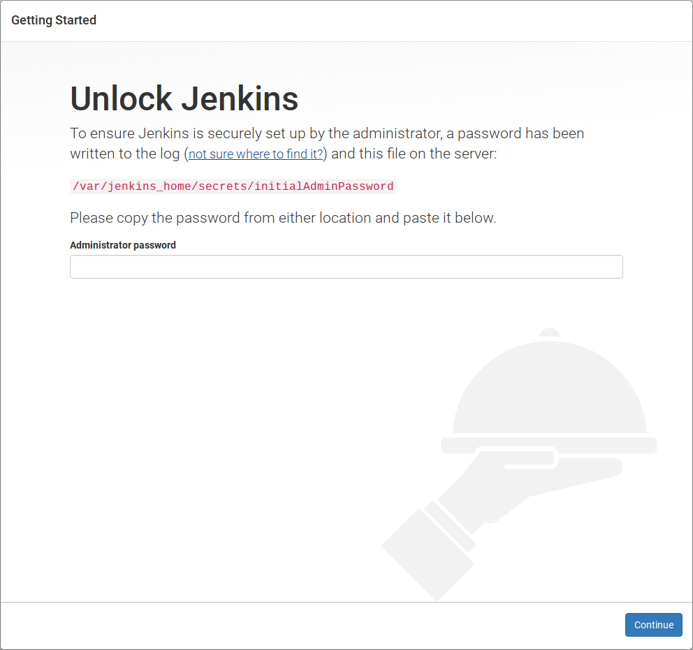

# jenkins_docker
================

**Criação de um volume local para persistência de dados do Jenkins:**

```shell
$ docker volume create jenkins_home
```

**Verificando o volume criado:**

```shell
$ docker volume ls | grep jenkins_home
```

**Verificando detalhes:**

```shell
$ docker volume inspect jenkins_home
```

**Baixar a versão LTS do Jenkins:**

```shell
$ docker pull jenkins/jenkins:lts
```

**Subir o container:**

```shell
$ docker-compose up
```

**Acessando o Jenkins no endereço:**

http://127.0.0.1:8080


